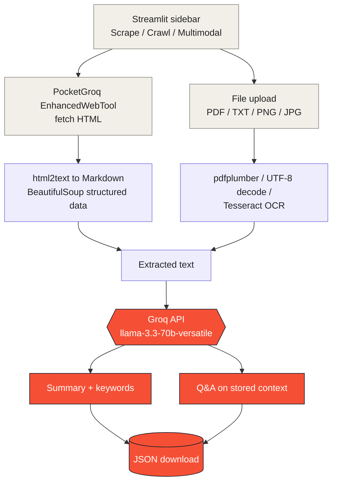

<div align="center">


<a href="#-how-it-works"></a>

<br/>


<br/>

[](https://www.python.org)
[](https://streamlit.io)
[](https://console.groq.com)
[](https://pypi.org/project/pocketgroq/)
[](https://github.com/tesseract-ocr/tesseract)
[](https://github.com/jsvine/pdfplumber)
<br/>
[](#-status-and-known-limitations)
[](LICENSE)

</div>

---

##  Project Overview

GroqGazer is a **Streamlit app** that turns web pages and documents into short, searchable insights. You give it a URL (scrape one page or crawl a site) or upload a PDF, text file or image. It extracts the text, then asks a Groq-hosted LLM to **summarise** it, pull out **keywords**, and **answer questions** about it. Results can be downloaded as JSON.

It was built in April 2025 as a prototype. Scraping, crawling, document upload, summaries, keywords and Q&A all work. The planned audio mode was never built, and Q&A is simple prompting, not retrieval; see [Status and known limitations](#-status-and-known-limitations).

> The model runs on **Groq** (the inference provider) through the `groq` SDK and the **PocketGroq** helper library. It is not an xAI Grok model.

### Key Features

-  **Scrape**: fetch one URL and view it as Markdown, raw HTML or structured data (title, meta description, headings).
-  **Crawl**: follow links with a depth limit and a page limit (capped at 50), with include and exclude path filters, sitemap and backwards-link switches.
-  **Multimodal upload**: PDFs (pdfplumber), UTF-8 text files, and images (Tesseract OCR).
-  **AI insights**: a 100-word summary and five keywords per document or page, and free-form questions about the extracted content.
-  **Export**: download scrape, crawl and analysis results as JSON.

##  How It Works


```mermaid
flowchart TD
    UI[Streamlit sidebar<br/>Scrape / Crawl / Multimodal] --> W[PocketGroq EnhancedWebTool<br/>fetch HTML]
    UI --> F[File upload<br/>PDF / TXT / PNG / JPG]
    W --> H[html2text to Markdown<br/>BeautifulSoup structured data]
    F --> X[pdfplumber / UTF-8 decode /<br/>Tesseract OCR]
    H --> T[Extracted text]
    X --> T
    T --> G{{Groq API<br/>llama-3.3-70b-versatile}}
    G --> S[Summary + keywords]
    G --> Q[Q&A on stored context]
    S --> J[(JSON download)]
    Q --> J

    classDef src fill:#F1EFE8,stroke:#888780,color:#222
    classDef proc fill:#EEEDFE,stroke:#7F77DD,color:#222
    classDef llm fill:#F55036,stroke:#111827,color:#fff
    class UI,W,F src
    class H,X,T proc
    class G,S,Q,J llm
```

| Step | Detail |
|---|---|
| Input limits | Only the first 4,000 characters of a page are sent to the model for each summary, keyword and Q&A call |
| Stored context | Up to 100,000 characters are kept in the session for Q&A |
| Summary | 100 words or less (max 150 tokens) |
| Keywords | Top 5, comma-separated |
| Answer | Max 200 tokens |

##  Requirements

- Python 3.11+
- A **Groq API key** from [console.groq.com](https://console.groq.com)
- **Tesseract OCR** installed on the system, only needed for image uploads
- Internet access, for the Groq API and for scraping

No local model server is needed.

##  Quick Start

### Installation

```bash
git clone https://github.com/mukesh-dev-git/groqgazer.git
cd groqgazer

python -m venv venv
source venv/bin/activate  # On Windows: venv\Scripts\activate

pip install -r requirements.txt
```

Install Tesseract for image OCR:

```bash
sudo apt install tesseract-ocr     # Debian / Ubuntu
brew install tesseract             # macOS
# Windows: install from https://github.com/UB-Mannheim/tesseract/wiki and add it to PATH
```

### Configuration

```bash
cp .env.example .env
# then set GROQ_API_KEY in .env
```

`.env` is gitignored. Never commit your key.

### Run

```bash
streamlit run groqgazer.py
```

Open [http://localhost:8501](http://localhost:8501). In GitHub Codespaces the included devcontainer installs everything (including Tesseract through `packages.txt`) and starts the app on port 8501.

##  Usage

| Mode | What to do |
|---|---|
| **Scrape** | Enter a URL, pick output formats, click *Run Scrape* |
| **Crawl** | Enter a start URL, set max depth and max pages, click *Run Crawl* |
| **Multimodal** | Upload a PDF, TXT, PNG or JPG, then click *Analyze* |
| **Q&A** | After extraction, type a question under *Ask Questions about the Extracted Content* |
| **Clear Cache** | Sidebar button that clears the stored Q&A context |

##  Project Structure

```
groqgazer/
├── groqgazer.py             # the whole Streamlit app
├── requirements.txt
├── packages.txt             # system packages (Tesseract) for Codespaces / Streamlit Cloud
├── .env.example             # GROQ_API_KEY template
├── .devcontainer/           # GitHub Codespaces setup
└── logo.png
```

##  Status and Known Limitations

| Area | State |
|---|---|
| Scrape and crawl | Working |
| Markdown, HTML, structured-data output | Working |
| PDF, text and image analysis | Working (images need Tesseract) |
| Summary, keywords | Working |
| Q&A | Works by putting the stored text in the prompt; there is **no retrieval or embedding step** |
| Audio mode (voice in, spoken answers) | Planned, not built |
| Result persistence | Scrape and crawl output disappears when another button is pressed, because Streamlit reruns the script; the stored context still answers questions |
| Crawl cost | One summary call and one keyword call per crawled page, which can hit Groq rate limits on large crawls |
| Model | `llama-3.3-70b-versatile` is hard-coded as `MODEL_NAME`; if Groq retires it, the app shows a message and you change that constant |
| Tests, deployment | Not implemented |

### External services

| Service | Used for | Needed to run? |
|---|---|---|
| Groq API | Summaries, keywords, Q&A | Yes (API key) |
| PocketGroq (library) | Fetching and crawling pages | Yes (installed with `pip`) |
| Tesseract OCR (system program) | Reading text from images | Only for image uploads |
| GitHub Codespaces | Optional hosted dev environment through `.devcontainer` | No |

##  Ideas for Next Steps

- Add real retrieval: chunk the content, embed it and answer from the best chunks
- Keep scrape and crawl results in session state so they survive reruns
- Summarise a whole crawl once instead of every page
- Build the audio mode
- Add tests, and read the model name from an environment variable

##  License

MIT. See [LICENSE](LICENSE).

<div align="center">


</div>
