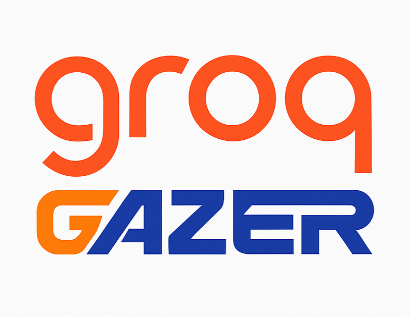

# GrokGazer



## Overview

GrokGazer is a cutting-edge, multimodal web intelligence explorer powered by the advanced AI capabilities of Grok 3, developed by xAI. Designed to empower students, coders, programmers, researchers, and innovators, GrokGazer tackles real-world challenges by transforming the way users interact with web data and documents. Leveraging Grok's state-of-the-art natural language processing and retrieval-augmented generation (RAG), this application extracts, analyzes, and synthesizes information with unprecedented efficiency, enabling users to unlock actionable insights from vast digital landscapes.

### Solving Real-World Problems

- **For Students**: Streamlines research by scraping and summarizing academic websites, helping with thesis work, study materials, and exam preparation.
- **For Coders and Programmers**: Accelerates code documentation and bug tracking by crawling repositories or forums, extracting keywords, and providing context-aware answers.
- **For Researchers**: Enhances data collection from diverse sources, offering structured outputs for analysis and hypothesis validation.
- **For Innovators**: Facilitates rapid prototyping by analyzing technical documents and web resources, fostering creativity with AI-driven insights.

By harnessing Grok 3's `llama-3.3-70b-versatile` model, GrokGazer delivers high-fidelity summarization, keyword extraction, and question-answering, optimized for scalability and precision. Integrated with PocketGroq's web crawling tools, it redefines how professionals and learners process information in an AI-augmented era.

## Features

- **Web Scraping**: Extract content from a single URL in Markdown, HTML, or structured data formats.
- **Website Crawling**: Navigate multiple pages with customizable depth and filters, outputting in Markdown, HTML, or structured data.
- **Multimodal Analysis**: Process uploaded PDFs, text files, and images, extracting text for AI-driven insights.
- **AI-Powered Insights**: Utilize Grok 3's AI to summarize content, extract keywords, and answer questions based on scraped or uploaded data.
- **Download Options**: Export results as JSON for offline use.
- **User Interface**: Streamlit-based UI with a sidebar for mode selection (Scrape, Crawl, Multimodal) and options, plus tabs for output viewing.
- **Cache Management**: Clear session state cache to optimize memory usage.
- **About Section**: Access detailed app information via a sidebar expander.

*Future Enhancements*: Audio mode for voice input and response playback is planned to further enhance accessibility and interaction.

## Prerequisites

- Python 3.11+
- Git (for cloning the repository)
- Internet connection (for API calls and web scraping)
- Microphone and speakers (for future audio mode)
- Ollama server (for local model management)

## Installation

1. **Clone the Repository**:

   ```
   git clone https://github.com/yourusername/GroqGazer.git
   cd GroqGazer
   ```

1. **Set Up Environment**:
    - Install Python dependencies:
        
   ```
   `pip3 install --user -r requirements.txt`
   ```

2. **Configure API Keys**:
    - Create a .env file in the project root:
        
   ``` 
   `GROQ_API_KEY=your_groq_api_key_here`
   ```

   - Obtain a Groq API key from [https://console.groq.com](https://console.groq.com/).
3. **Pull Ollama Models**:
    - Install Ollama: Follow instructions at [https://ollama.com](https://ollama.com/).
    - Pull required models:
        
   ```
   `ollama pull llama3
   ollama pull nomic-embed-text`
   ```

4. **Run the Application**:
    - Start the Streamlit app:
        
   ```
   `streamlit run groqgazer.py --server.enableCORS false --server.enableXsrfProtection false`
   ```

   - Open your browser at http://localhost:8501 to use GrokGazer.

## Usage

- **Scrape Mode**: Enter a URL and select output formats to scrape content.
- **Crawl Mode**: Set depth and page limits to crawl a website.
- **Multimodal Mode**: Upload files (PDF, TXT, PNG, JPG) for analysis.
- **Q&A**: Ask questions based on extracted content.
- **Cache**: Clear cache via the sidebar button to manage memory.
- **About**: Expand the sidebar for app details.

## Contributing

Contributions are welcome! Please fork the repository, create a feature branch, and submit a pull request with your changes.

## License

MIT License - Feel free to modify and distribute.

## Support

For issues or questions, open an issue on GitHub or contact the maintainers.

*Built with ❤️ using Streamlit, PocketGroq, Groq, and xAI's Grok 3 technology.*